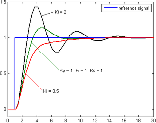
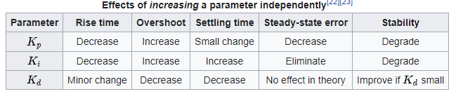

# CarND-Controls-PID
Self-Driving Car Engineer Nanodegree Program

---
## Objective

The objective is to implement and tune a PID controller that can be used to manuver a car around a simulated race track.

The simulator provides the current speed, steering angle and cross track error (cte) as inputs. The controller uses this information to determine an appropriate steering anlge and throttle that ensures safe driving and driver comfort.

## Introduction
[Wikipedia - Reference](https://en.wikipedia.org/wiki/PID_controller)


The block diagram above showcases how a PID controller utilizes three control terms to accurately exert optimal control to attain desired testpoint. The input to the controller is the error which is defined as the difference between the desired setpoint and the actual value (process variable).

Lets take a look at each of this control terms:

* The proportional term **P** as the name suggests exerts a control that is proportional to the error. Which also implies that there is a need for an error to generate a response. This in isolation will result in a constant oscillation about the setpoint.
* The integral term **I** operates on the cummulative error and is usually used to eliminate systemic bias. 
* The derivative term **D** operates on the rate of change of error. This is a damping force to reduce the overshoot or undershoot around the desired setpoint. In a stable system , this will result in a decaying sinusoid around the desired set point.


The best approach to visualize the impact of each control term is to observe the step response of the system:

#### Varying Kp

#### Varying Ki

#### Varying Kd


## Hyperparameter Tuning
This is the process of tuning the control parameters to obtain the desired response.    
It is important to ensure system stability while tuning parameters and there are mathematical explanations of what implies stability given the plant and controller transfer functions.
The simplest things to keep in mind is that if the **output diverges** , error monotonically increases on a straight path, or oscillations increase in magnitude over time; the system is **unstable**

###Manual Tuning

In order to get an initial estimate for the parameters and reduce the time it takes auto tune the parameters , I decided to provide an initial guess for the parameters using manual tuning.
I use the following table from wikipedia for guidance, based on observed behavior:



I had some success slowly increasing the proportional term but trying to reduce the oscillations by changing the derivative constant proved harder than expected. The systems was quickly becoming unstable as the track characteristics changed over time.
In hindsight I also did not take the speed of the vehicle into account and the monotonic increase in velocity led to the instability.

### Twiddle ###
I used the twiddle (gradient descent) algorithm to tune the parameters as shown in the course. 
 
##### Challenge 1 : Scene Reset #####
 In order to compare two iterations, the car must run along the same path. This required that the scene be reset. 
 
 The following [user question](https://knowledge.udacity.com/questions/6171) has the answer I was looking for. The message to reset the scene is:
 
 `string resetmsg = "42[\"reset\",{}]";`
 
##### Challenge 2 : Velocity #####

Stop the velocity from monotonically increasing, especially when teh steering angle is steep.   
Since the speed is not a passing criteria, I set the max speed to 30mph and varied the target speed as a factor of the steering angle.

A better approach would have been to have an independent PID controller for the throttle but a linear variation seems to do the trick for now.


##### Challenge 3 : Off Track #####

It is important that when the car veered off road or into unsafe areas, it was penialized more irrespective of the (averaged) error value over the entire course.
Utilized the following condition to determine if it was off track or stuck:  

`(twiddle && timestep>10 && fabs(cte)>3) || (twiddle && timestep>40 && speed<0.2)`

##### Challenge 5 : Change in track characteristics #####

The parameters determined based on the car navigating the initial portion of the track wasn't suitable for the more curvier parts.
My solution was to tune it over longer periods, ignoring larger portions of the beginning.

|Total Timesteps|Timesteps to ignore|
|---------------|-------------------|
|     200       |       100         |
|     400       |       200         |
|     600       |       300         |
|    1200       |       300         |

## Result

The final optimized set of parameters is:   
`pid.Init(1.4741, 0.000164132, 0.00449996)`

## Next Steps

* The oscillations need to be damped way further for this ride to be comfortable (currently nauseous :) ). Need to tune the parameters more.
* Implement a PID controller for the throttle input and let the speed go all the way up if possible.

## Dependencies

* cmake >= 3.5
 * All OSes: [click here for installation instructions](https://cmake.org/install/)
* make >= 4.1(mac, linux), 3.81(Windows)
  * Linux: make is installed by default on most Linux distros
  * Mac: [install Xcode command line tools to get make](https://developer.apple.com/xcode/features/)
  * Windows: [Click here for installation instructions](http://gnuwin32.sourceforge.net/packages/make.htm)
* gcc/g++ >= 5.4
  * Linux: gcc / g++ is installed by default on most Linux distros
  * Mac: same deal as make - [install Xcode command line tools]((https://developer.apple.com/xcode/features/)
  * Windows: recommend using [MinGW](http://www.mingw.org/)
* [uWebSockets](https://github.com/uWebSockets/uWebSockets)
  * Run either `./install-mac.sh` or `./install-ubuntu.sh`.
  * If you install from source, checkout to commit `e94b6e1`, i.e.
    ```
    git clone https://github.com/uWebSockets/uWebSockets 
    cd uWebSockets
    git checkout e94b6e1
    ```
    Some function signatures have changed in v0.14.x. See [this PR](https://github.com/udacity/CarND-MPC-Project/pull/3) for more details.
* Simulator. You can download these from the [project intro page](https://github.com/udacity/self-driving-car-sim/releases) in the classroom.

Fellow students have put together a guide to Windows set-up for the project [here](https://s3-us-west-1.amazonaws.com/udacity-selfdrivingcar/files/Kidnapped_Vehicle_Windows_Setup.pdf) if the environment you have set up for the Sensor Fusion projects does not work for this project. There's also an experimental patch for windows in this [PR](https://github.com/udacity/CarND-PID-Control-Project/pull/3).

## Basic Build Instructions

1. Clone this repo.
2. Make a build directory: `mkdir build && cd build`
3. Compile: `cmake .. && make`
4. Run it: `./pid`. 

Tips for setting up your environment can be found [here](https://classroom.udacity.com/nanodegrees/nd013/parts/40f38239-66b6-46ec-ae68-03afd8a601c8/modules/0949fca6-b379-42af-a919-ee50aa304e6a/lessons/f758c44c-5e40-4e01-93b5-1a82aa4e044f/concepts/23d376c7-0195-4276-bdf0-e02f1f3c665d)

