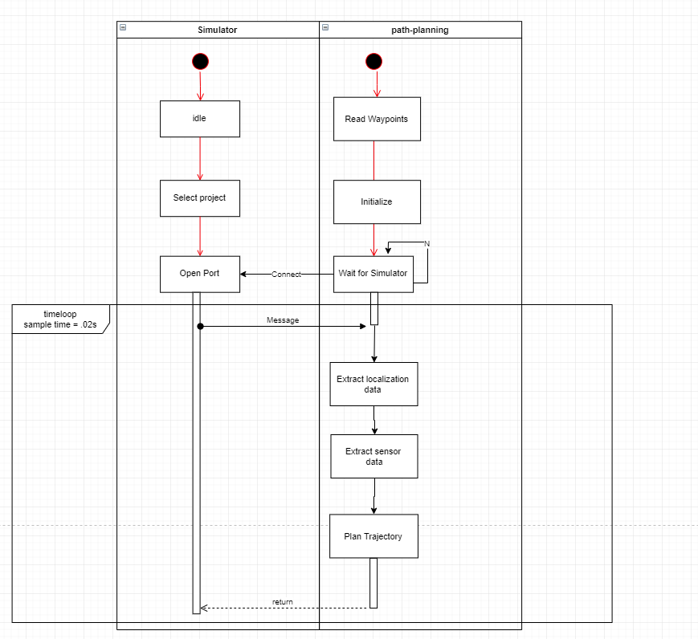
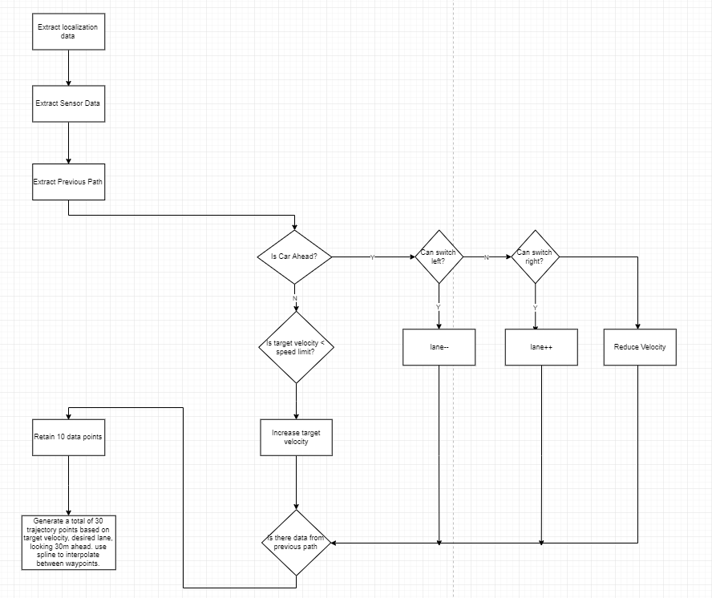
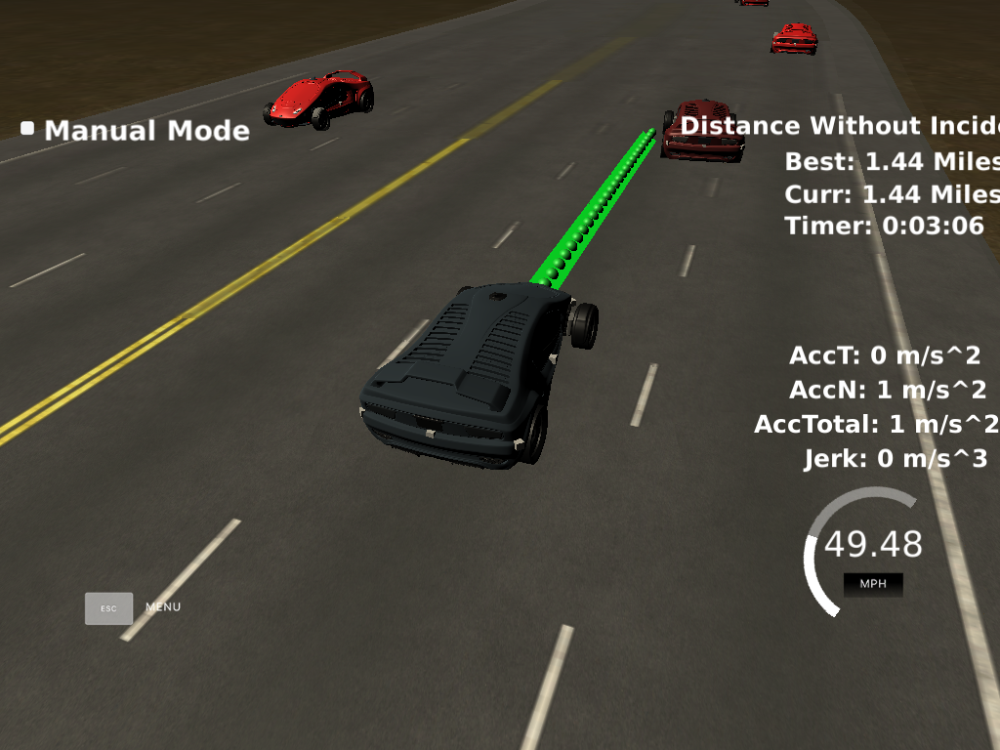
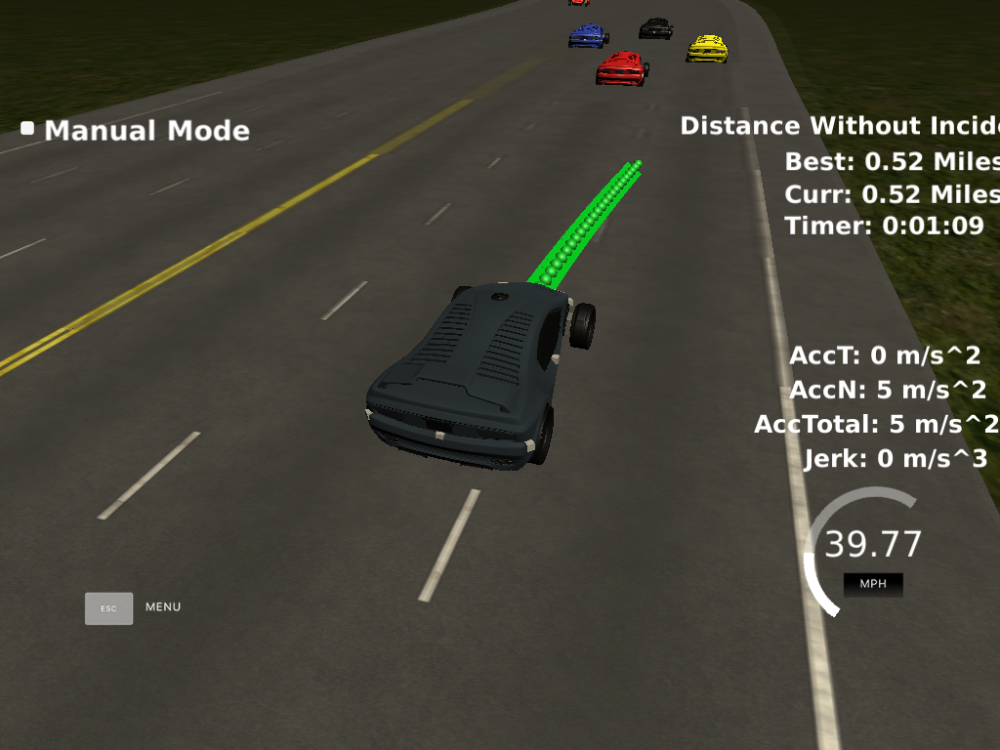
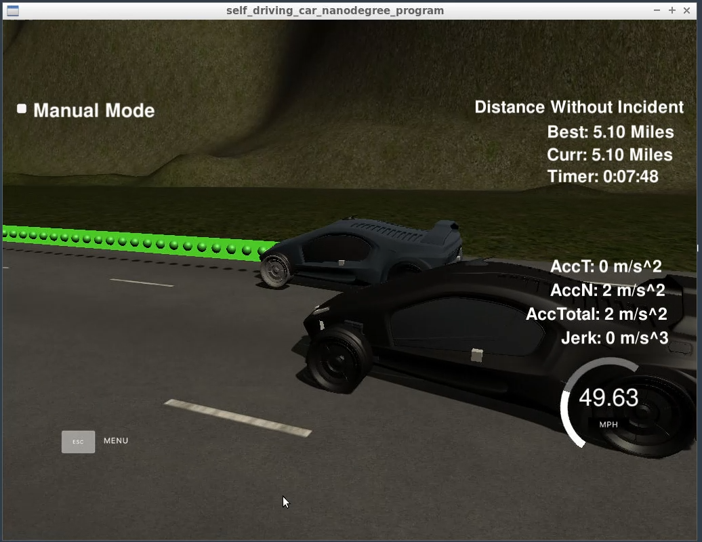

# CarND-Path-Planning-Project
Self-Driving Car Engineer Nanodegree Program


### Objective

The goal of this project to is to path plan for a car to safely navigate around a simulated highway scenario, in the presence of traffic and associated sensor fusion data.

#### Requirements and Constraints
* The car is able to drive at least 4.32 miles without incident.
* The car drives according to the speed limit. (50mph)
* The car does not exceed a total acceleration of 10 m/s^2 and a jerk of 10 m/s^3.
* Car does not have collisions.
* The car doesn't spend more than a 3 second length out side the lane lanes during changing lanes, and every other time the car stays inside one of the 3 lanes on the right hand side of the road.
* The car is able to smoothly change lanes when it makes sense to do so, such as when behind a slower moving car and an adjacent lane is clear of other traffic.

### Algorithm

#### Activity diagram
At a very high level the different modules communicated as shown in the following activity diagram:
   

The basic logic is as described in the following flow chart:  



### Challenges and Approach

##### 1. Stay within acceleration limits    
As shown in the QA section, any increase in velocity is done incrementally. The acceleration is limited to 5 m/s^2.

```double max_change_velocity = .224; // To comply with max acceleration of 10m/s^2 , this is equivalent to 5 m/s^2. max_delta_v = 5 * .02 = .1 m/s = .1*2.24 mph = .224mph```        

However, while deccelerating, the rate of change is gradually increased based on how long we have had car ahead within what we considedr unsafe lookahead distance.

```close_count+=.5;```

##### 2. Look for cars around

Each time step we review the sensor fusion results to determine the cars close to ego and determine their distance.
We predict the distance of the car based on its current speed into the future.
We use this information to determine possibilty of collision under the current velocity and also determine if it safe to make a lane change.

##### 3. Lane change

Lane change is performed only when :
* There is car ahead
* There is no car on the left or right lane that is close to ego
* The velocity is not too high or low
* We give preference to a left lane change over right

##### 4. Trajectory Generation

I have chosen to generate a 50 point trajectory.
I retain a maximum of 10 points from the previous time step's trajectory. This is to mitigate jerk and at the same time be able to react to quick changes in the driving scenario. Like a neighboring car , changing its lane into the ego vehicles lane.

 
In order to generate additional way points, we leverage the spline library. 
We first create a spline (as showd in the QA section) from the last couple of points in the previous trajectory to about 90 meters ahead.
We then sample the spline for additional data points upto a distance of 30 meters ahead.
In the absence of the previous trajectory points, we use the car's current position, yaw to determine starting point of trajectory.

All of the spline calculation has been done in the car's reference frame and then converted to the maps reference frame. 
I have created two convenience functions in helper.c : ```getCarXY and getMapXY```


##### 5. Results
**Lane Change**



**Final Result**




### Future Actions

* Implement a Finite State Machine
* Author costFunctions to choose an optimal trajectory
* Currently the car doesn't follow a vehicle in front of it, when it isn't possible to change lanes. Rather it constantly accelerates and slows down. One could use the speed of the car in front of it to avoid this. This would also tie well into the FSM implementation. 
   
### Simulator.
You can download the Term3 Simulator which contains the Path Planning Project from the [releases tab (https://github.com/udacity/self-driving-car-sim/releases/tag/T3_v1.2).  

To run the simulator on Mac/Linux, first make the binary file executable with the following command:
```shell
sudo chmod u+x {simulator_file_name}
```

## Basic Build Instructions

1. Clone this repo.
2. Make a build directory: `mkdir build && cd build`
3. Compile: `cmake .. && make`
4. Run it: `./path_planning`.

Here is the data provided from the Simulator to the C++ Program

#### Main car's localization Data (No Noise)

["x"] The car's x position in map coordinates

["y"] The car's y position in map coordinates

["s"] The car's s position in frenet coordinates

["d"] The car's d position in frenet coordinates

["yaw"] The car's yaw angle in the map

["speed"] The car's speed in MPH

#### Previous path data given to the Planner

//Note: Return the previous list but with processed points removed, can be a nice tool to show how far along
the path has processed since last time. 

["previous_path_x"] The previous list of x points previously given to the simulator

["previous_path_y"] The previous list of y points previously given to the simulator

#### Previous path's end s and d values 

["end_path_s"] The previous list's last point's frenet s value

["end_path_d"] The previous list's last point's frenet d value

#### Sensor Fusion Data, a list of all other car's attributes on the same side of the road. (No Noise)

["sensor_fusion"] A 2d vector of cars and then that car's [car's unique ID, car's x position in map coordinates, car's y position in map coordinates, car's x velocity in m/s, car's y velocity in m/s, car's s position in frenet coordinates, car's d position in frenet coordinates. 

## Details

1. The car uses a perfect controller and will visit every (x,y) point it recieves in the list every .02 seconds. The units for the (x,y) points are in meters and the spacing of the points determines the speed of the car. The vector going from a point to the next point in the list dictates the angle of the car. Acceleration both in the tangential and normal directions is measured along with the jerk, the rate of change of total Acceleration. The (x,y) point paths that the planner recieves should not have a total acceleration that goes over 10 m/s^2, also the jerk should not go over 50 m/s^3. (NOTE: As this is BETA, these requirements might change. Also currently jerk is over a .02 second interval, it would probably be better to average total acceleration over 1 second and measure jerk from that.

2. There will be some latency between the simulator running and the path planner returning a path, with optimized code usually its not very long maybe just 1-3 time steps. During this delay the simulator will continue using points that it was last given, because of this its a good idea to store the last points you have used so you can have a smooth transition. previous_path_x, and previous_path_y can be helpful for this transition since they show the last points given to the simulator controller with the processed points already removed. You would either return a path that extends this previous path or make sure to create a new path that has a smooth transition with this last path.

---

## Dependencies

* cmake >= 3.5
  * All OSes: [click here for installation instructions](https://cmake.org/install/)
* make >= 4.1
  * Linux: make is installed by default on most Linux distros
  * Mac: [install Xcode command line tools to get make](https://developer.apple.com/xcode/features/)
  * Windows: [Click here for installation instructions](http://gnuwin32.sourceforge.net/packages/make.htm)
* gcc/g++ >= 5.4
  * Linux: gcc / g++ is installed by default on most Linux distros
  * Mac: same deal as make - [install Xcode command line tools]((https://developer.apple.com/xcode/features/)
  * Windows: recommend using [MinGW](http://www.mingw.org/)
* [uWebSockets](https://github.com/uWebSockets/uWebSockets)
  * Run either `install-mac.sh` or `install-ubuntu.sh`.
  * If you install from source, checkout to commit `e94b6e1`, i.e.
    ```
    git clone https://github.com/uWebSockets/uWebSockets 
    cd uWebSockets
    git checkout e94b6e1
    ```
