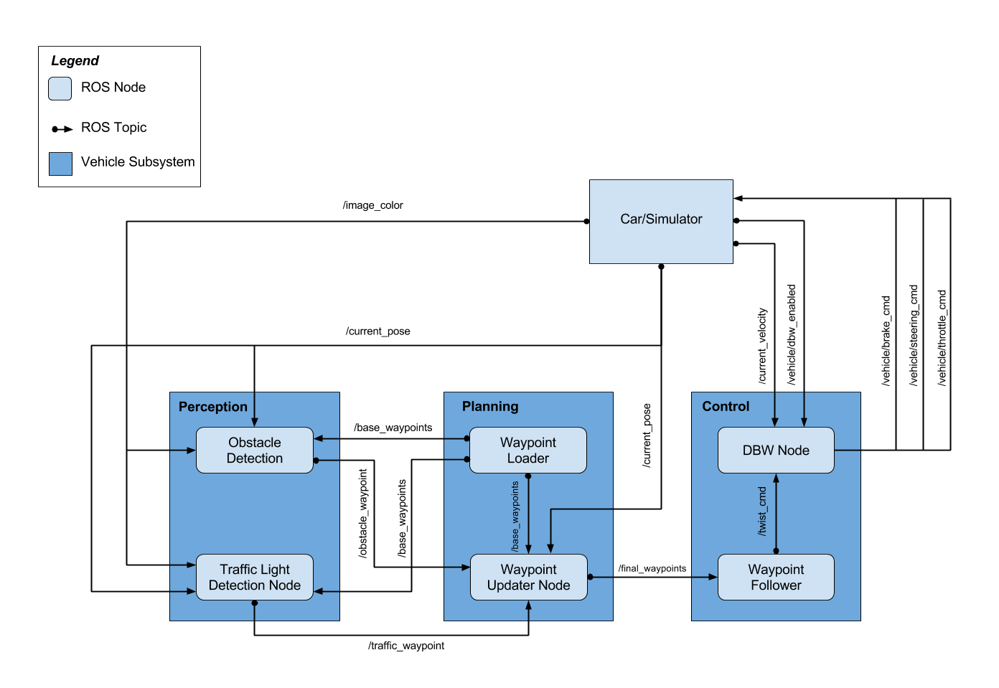
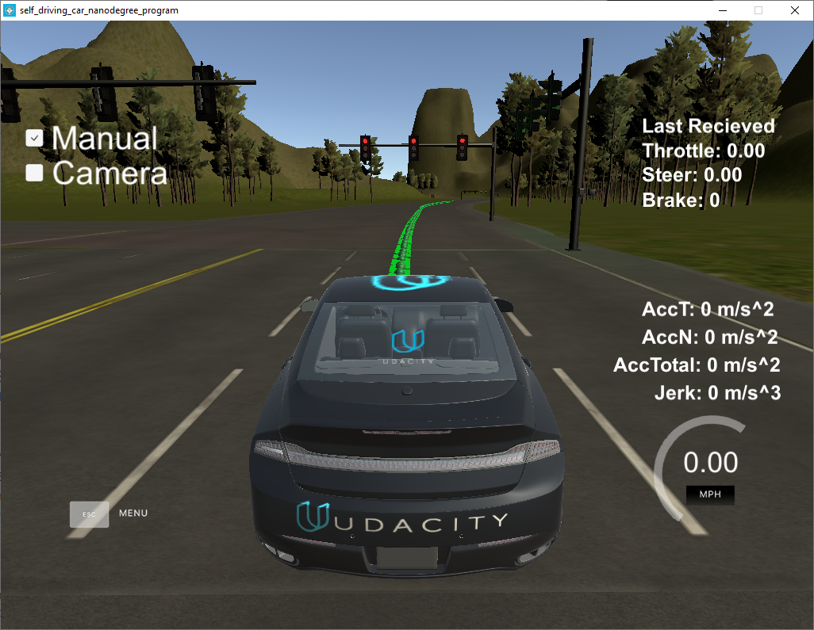
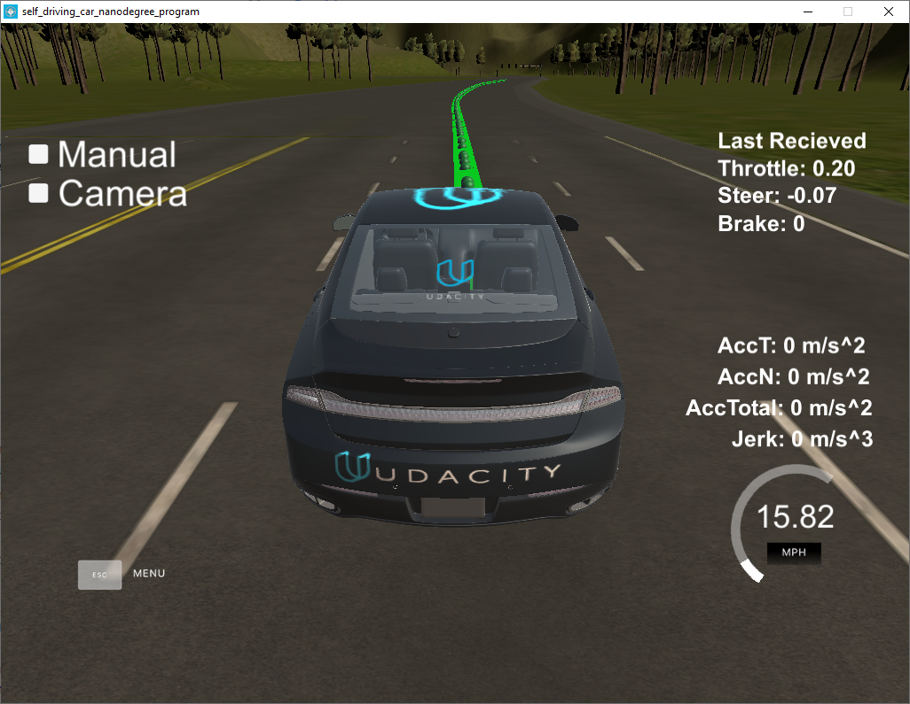
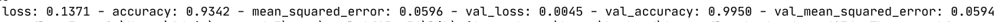
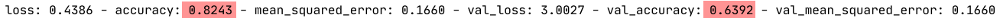
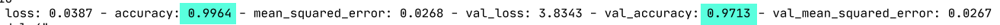
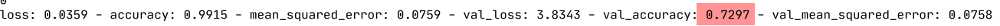
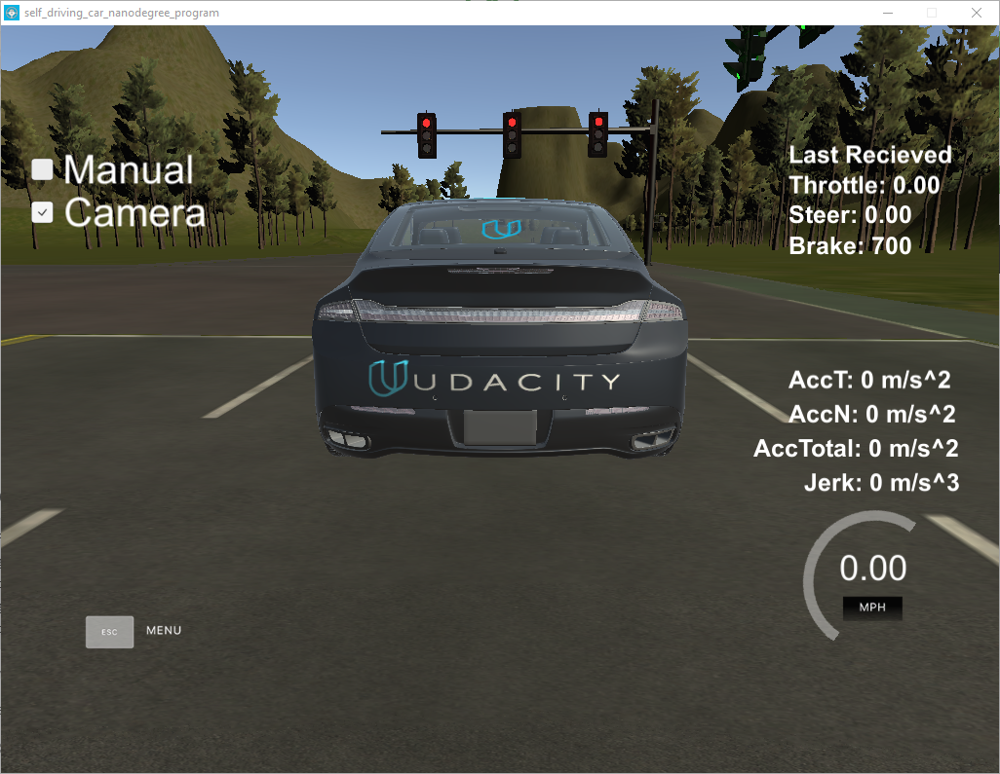
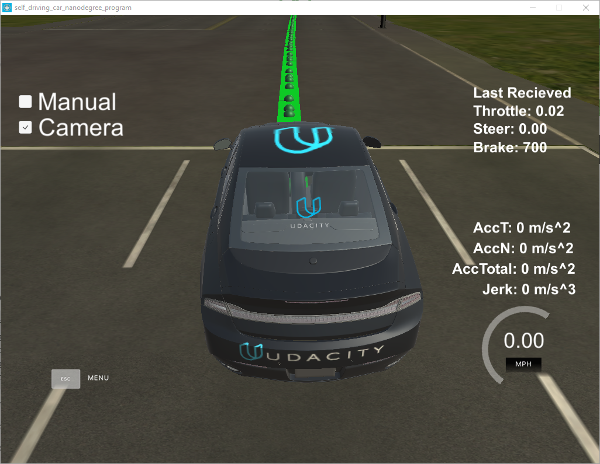
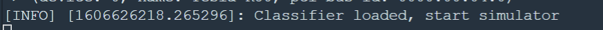

# Udacity Self-Driving Car Nanodegree - Capstone Project

### Introduction

This project is all about system integration for a fully autonomous self-driving car. 
Typically there are two options to test the installation; within a unity based simulator (Individuals) or on the actual car _Carla_ (Teams).
Given that this is 2020 , the second option is unfortunately unavailable at the moment.

ROS is the middleware of choice and the various components of the system communicate via ROS messages.

### Implementation
My implementation closely followed the great walkthroughs that were provided for the project.

#### Waypoint Updater (Partial) 
**Node : waypoint_updater**   
**File : waypoint_updater.py**   

* Subscribe to _/base_waypoints_
* Subscribe to _/current_pose_   
`rospy.Subscriber('/current_pose', PoseStamped, self.pose_cb)`   
 `rospy.Subscriber('/base_waypoints', Lane, self.waypoints_cb)`
* Find closest waypoint ahead (uses KDTree and basic vector arithmetic)
* Publish trajectory (200 waypoints ahead from the closest way points)

Having completed this one will be able to view the waypoints within the simulator.

#### DBW (Drive by Wire) Node
**Node : DBW**   
**File1 : dbw_node.py**   
**File2 : twist_controller.py**   

* A lowpass filter has already been provided to remove the high frequency variations from the velocity.
* Two controllers are provided out of the box : `YawController` and `PID`
* **Requirement :** This node has function only when the DBW system has been enabled. That is , the manual cheeckbox has been unchecked.
* First step: subscribe to required topics   
`self.twist_sub = rospy.Subscriber('/twist_cmd', TwistStamped, self.twist_cb)`   
`self.dbw_sub = rospy.Subscriber('/vehicle/dbw_enabled', Bool, self.dbw_cb)`   
`self.vel_sub = rospy.Subscriber('/current_velocity', TwistStamped, self.vel_cb)`   
`self.waypoints_sub = rospy.Subscriber('/final_waypoints', Lane, self.waypoints_cb)`   
`self.pos_sub = rospy.Subscriber('/current_pose', PoseStamped, self.pose_cb)`   
* Create publishers for required topics   
`self.steer_pub = rospy.Publisher('/vehicle/steering_cmd',
                                         SteeringCmd, queue_size=1)`   
`self.throttle_pub = rospy.Publisher('/vehicle/throttle_cmd',   
                                            ThrottleCmd, queue_size=1)`   
`self.brake_pub = rospy.Publisher('/vehicle/brake_cmd',
                                         BrakeCmd, queue_size=1)`   
* Publish the Controllers output when required:   
`if self.is_dbw_enabled:`   
`                self.publish(throttle, brake, steering)`   
* The controller in itself is pretty simple:   
  * It uses a PID controller to control the throttle based on `velocity_error` and `delta_t
  * It uses a YawController to control the steering based on linear , angular and current velocity.
  * Since this is an automatic drive system, force of 700Nm is required to ensure complete vehicle stoppage.
  * If not a proportional force calculated using deceleration * vehicle mass * wheel radius is applied.
  
 With these minor changes, the car will go around the track without any issues but will still not obey any traffic lights.
 
 

#### Traffic Light Detection and Complete Waypoint Updater

When DBW is enabled and the camera images are being published, it is required that the vehicle obey the traffic lights and stop on reds.
This requires three pieces to be implemented.

* A classifier that can determine the state of the light from the camera image.
* A detector that provides the stop line location and the state of the light from the classifier
* A waypoint updater that determines if it is close to a red light and changes the velocities of the projected way points to decelerate and stop within the stop line , in the presence of a red light.

##### Image Collection
Before one can design a classifier, it is important to get a lot of images to train and validate on. 
The typical approach would be to:
* Record a rosbag when driving around in the simulator with the Camera data being published.   
http://wiki.ros.org/rosbag/Commandline#rosbag_record
* Extract the images from the rosbag.   
http://wiki.ros.org/rosbag/Tutorials/Exporting%20image%20and%20video%20data
* Label the images.   
https://github.com/AlexeyAB/Yolo_mark
https://www.mathworks.com/help/vision/ug/get-started-with-the-image-labeler.html

Since this wasn't an objective for this project, I used data curated by ex-Udacity students (a huge thanks!!!) and publicly available datasets for non-commercial use.
* [Vatsal Srivastava](https://drive.google.com/file/d/0B-Eiyn-CUQtxdUZWMkFfQzdObUE/view)
* [Alex Lechner](https://www.dropbox.com/s/vaniv8eqna89r20/alex-lechner-udacity-traffic-light-dataset.zip?dl=0)
* [Heidelberg Dataset](https://hci.iwr.uni-heidelberg.de/content/bosch-small-traffic-lights-dataset)
* [LISA Traffic Light Dataset](https://www.kaggle.com/mbornoe/lisa-traffic-light-dataset)

##### Classifier
**File :CarND-Capstone/tl_classification.py**   
**Training Results : CarND-Capstone/TrainingReport.pdf**   
**YAML Files for all Models : CarND-Capstone/\*.yaml**

Based on the information available from the following references and the behavior cloning project:
* [Keras Applications](https://keras.io/api/applications)
* [Popular Architectures](https://blog.paperspace.com/popular-deep-learning-architectures-resnet-inceptionv3-squeezenet/)

I tried 4 models:
1. ResNet50   

2. InceptionV3 (Freezing all convolution layers from the base)

3. InceptionV3 Without Top

4. InceptionV3 Without Top and fine tuning by freezing layers

Both ResNet50 and InceptionV3 without top performed great. However, I went ahead with Resnet50 as it produced more consistent predictions.

With all of these piece in place, the vehicle successfully navigates the simulator track and stops at lights.

[Video Link](https://youtu.be/AYOPNtYVhBM)

### Instructions to Run

* Wait for the classifier to load before starting the simulator.

* Turn on Camera
* Uncheck Manual

### References:
* [Original Project Repo](https://github.com/udacity/CarND-Capstone)   
  * This has the recommended install instructions and testing scenarios